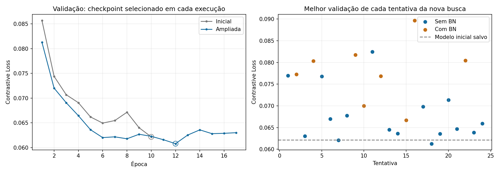
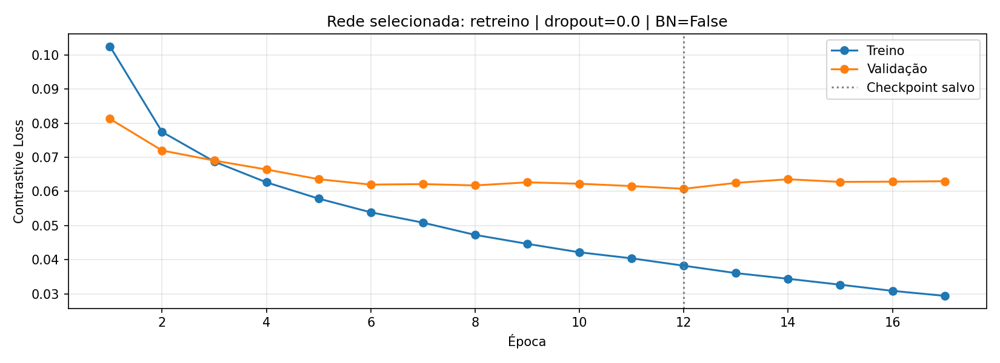

# Resultado oficial — busca ampliada e perda de validação

Perda de validação: **0.062161 → 0.060785** (2.21% de redução relativa).
Comparação realizada nas mesmas imagens, partições e pares, conferidos elemento a elemento.

## Protocolo

- RandomSearch: 24 configurações, até 20 épocas por tentativa.
- Retreinamento do vencedor: até 30 épocas; paciência 5 no EarlyStopping.
- Dropout: 0; 0,1; 0,2; 0,3; 0,4. Batch Normalization opcional antes da ReLU nas duas convoluções e na camada densa.
- Mantidos filtros, tamanhos de camadas e taxas de aprendizado do espaço anterior: 480 combinações possíveis.
- Margem 1, lote 128 e pares fixos: 30.000 treino, 6.000 validação, 10.000 teste.
- O checkpoint da busca e o retreinamento competem por menor val_loss. O teste só é usado após selecionar.
- Selecionado: **retreino**, trial 17, época 12.
- Melhor checkpoint da busca: 0.061292; retreinamento: 0.060785.
- Tempo registrado (dados, busca, retreinamento e avaliação): 26.3 minutos.

## Rede escolhida

| Hiperparâmetro | Valor |
|---|---:|
| filtros_1 | 32 |
| filtros_2 | 32 |
| unidades_densas | 128 |
| dimensao_embedding | 16 |
| dropout | 0.0 |
| batch_normalization | False |
| learning_rate | 0.001 |

## Avaliação

| Métrica | Inicial | Ampliada |
|---|---:|---:|
| Loss de validação | 0.062161 | 0.060785 |
| Loss de treino em inferência | 0.036552 | 0.033817 |
| Gap validação − treino em inferência | 0.025609 | 0.026968 |
| Acurácia de validação | 93.45% | 93.65% |
| Loss de teste | 0.065107 | 0.064513 |
| Acurácia de teste | 92.64% | 92.67% |
| Limiar calibrado na validação | 0.560570 | 0.537409 |





A curva de treino é medida durante atualizações, com dropout/BN em modo de treinamento.
A validação usa inferência; portanto, dropout pode fazer a loss de treino parecer maior.
A tabela também avalia o treino em inferência para comparar os conjuntos no mesmo modo.

## Tentativas

| Trial | BN | Dropout | Filtros | Densa | Vetor | LR | Melhor val_loss |
|---|---|---:|---|---:|---:|---:|---:|
| 17 | False | 0.0 | 32/32 | 128 | 16 | 0.001 | 0.061292 |
| 06 | False | 0.1 | 32/32 | 128 | 16 | 0.001 | 0.062076 |
| 02 | False | 0.1 | 32/32 | 128 | 16 | 0.0003 | 0.063050 |
| 18 | False | 0.1 | 32/32 | 128 | 64 | 0.0003 | 0.063550 |
| 13 | False | 0.0 | 16/32 | 128 | 32 | 0.001 | 0.063647 |
| 22 | False | 0.0 | 32/64 | 64 | 32 | 0.0003 | 0.063870 |
| 12 | False | 0.2 | 32/32 | 128 | 32 | 0.001 | 0.064499 |
| 20 | False | 0.1 | 16/32 | 64 | 64 | 0.0003 | 0.064703 |
| 23 | False | 0.2 | 16/32 | 64 | 16 | 0.0003 | 0.065931 |
| 14 | True | 0.2 | 32/64 | 128 | 64 | 0.001 | 0.066710 |
| 05 | False | 0.2 | 32/64 | 64 | 16 | 0.001 | 0.066986 |
| 07 | False | 0.3 | 16/32 | 128 | 32 | 0.001 | 0.067746 |
| 16 | False | 0.3 | 16/64 | 64 | 32 | 0.001 | 0.069836 |
| 09 | True | 0.1 | 32/64 | 64 | 16 | 0.0003 | 0.070003 |
| 19 | False | 0.4 | 16/32 | 128 | 64 | 0.0003 | 0.071354 |
| 04 | False | 0.4 | 32/32 | 64 | 16 | 0.001 | 0.076774 |
| 11 | True | 0.0 | 32/64 | 64 | 32 | 0.0003 | 0.076855 |
| 00 | False | 0.4 | 32/32 | 64 | 16 | 0.0003 | 0.076993 |
| 01 | True | 0.3 | 16/32 | 64 | 64 | 0.001 | 0.077284 |
| 03 | True | 0.0 | 16/32 | 64 | 16 | 0.0003 | 0.080344 |
| 21 | True | 0.2 | 16/32 | 128 | 32 | 0.0003 | 0.080488 |
| 08 | True | 0.0 | 16/32 | 64 | 32 | 0.0003 | 0.081734 |
| 10 | False | 0.4 | 16/32 | 64 | 64 | 0.0003 | 0.082489 |
| 15 | True | 0.3 | 32/32 | 64 | 64 | 0.0003 | 0.089673 |

## Arquivos e reprodução

`siamesa.keras`, `rede_base.keras`, `comparador.keras` e `metadata.json` correspondem ao candidato selecionado.
`vencedor_busca.keras` e `retreino.keras` preservam ambos os candidatos. `historico.json` e
`curva_loss.png` correspondem ao selecionado; `historico_retreino.json` guarda o retreinamento.
`tuner/siamesa/trial_*/historico.csv` contém todas as curvas da busca.
`codigo/` preserva os fontes usados e `codigo_anterior/` guarda os arquivos anteriores às alterações.

```bash
cd "/home/bahia/MO809/lab 4"
source ../venv-gpu/bin/activate
python experimento.py
python -m unittest -v test_lab4.py
# Repetir em OUTRO diretório, preservando esta execução:
python treinar.py --output output/repeticao_ampliada --referencia output --trials 24 --epocas-busca 20 --epocas 30 --paciencia 5
```

A execução inicial usada nesta comparação está preservada em
`../output_inicial_20260917/`. Os comandos padrão carregam este diretório `output/`.

## Limites da comparação

A melhoria mede o conjunto de validação usado na seleção. Não é prova de superioridade para todas as sementes ou dados.
Os hiperparâmetros e o orçamento mudaram juntos: não é uma ablação que isola o efeito causal de BN ou dropout.
Mais tentativas aumentam a adaptação à validação; o teste é apenas uma verificação final e não orientou as escolhas.
Os pares compartilham imagens dentro de cada partição. Não foi estimada incerteza entre execuções.

Referências: [Batch Normalization](https://keras.io/api/layers/normalization_layers/batch_normalization/),
[checkpoints do Keras Tuner](https://keras.io/keras_tuner/api/tuners/base_tuner/).

## Por que a margem não entrou nesta busca

A margem da Contrastive Loss é um hiperparâmetro treinável por busca, no sentido de
que o Keras Tuner pode selecionar um valor e treinar uma rede nova para ele. Ela não
é um peso aprendido por backpropagation. Como margens diferentes mudam a escala da
loss, `val_loss` deixa de ser uma medida diretamente comparável entre os trials.

Uma busca futura de margem deve L2-normalizar os embeddings e selecionar os trials
por uma métrica comum, como AUC ou acurácia balanceada. Se cada trial também calibrar
seu limiar, convém separar os dados de calibração dos dados usados para selecionar o
trial. Nesta execução, a margem permaneceu em 1 e somente o limiar de decisão foi
calibrado após o treinamento.

## Interpretação e verificação

O gap passou de 0.025609 para 0.026968. A redução de val_loss não eliminou o afastamento entre treino e validação.
A comparação da loss de treino usa o checkpoint salvo em modo de inferência; não o último ponto da curva.
Configuração selecionada: dropout=0.0, BN=False; o espaço de busca permitia ambos.
Acurácia de teste mudou +0.03 ponto percentual; não foi estimada variabilidade entre sementes.

- Com BN: 8 tentativas; melhor val_loss 0.066710 (grupos podem se sobrepor).
- Com dropout > 0: 18 tentativas; melhor val_loss 0.062076 (grupos podem se sobrepor).

Integração: 10 rodadas gRPC/Ray concluídas; vetores gerados em dois processos distintos.
Distâncias conferidas numericamente pelo experimento. [Resultados distribuídos](experimento.md).
Os testes passaram; consulte testes.log para a contagem e os casos executados.
