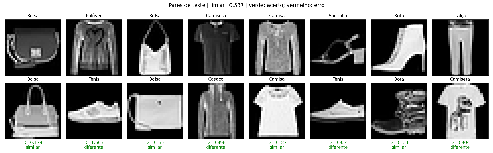

# Resultados do Laboratório 4

Esta pasta contém somente os modelos necessários para a demonstração distribuída,
os resultados finais do treinamento e as duas visualizações exigidas pelo exercício.

## Configuração escolhida

O Keras Tuner executou um `RandomSearch` com 24 configurações e até 20 épocas por
tentativa. A configuração vencedora foi treinada novamente por até 30 épocas, com
`EarlyStopping` de paciência 5. O checkpoint da época 12 foi restaurado.

| Hiperparâmetro | Valor escolhido |
|---|---:|
| Filtros Conv2D 1 | 32 |
| Filtros Conv2D 2 | 32 |
| Unidades densas | 128 |
| Dimensão do embedding | 16 |
| Dropout | 0,0 |
| Batch Normalization | Desativada |
| Taxa de aprendizado Adam | 0,001 |
| Margem da Contrastive Loss | 1,0 |

Dropout e Batch Normalization participaram do espaço de busca. O Tuner não os
selecionou porque as configurações correspondentes tiveram `val_loss` maior nesta
execução. O espaço completo e o resultado dos 24 trials estão em `busca.json`.

## Avaliação

O limiar `0,537409` foi calibrado exclusivamente nos pares de validação. Distâncias
menores ou iguais ao limiar são classificadas como similares.

| Métrica | Resultado |
|---|---:|
| Contrastive Loss de validação | 0,060785 |
| Acurácia de validação, 6.000 pares | 93,65% |
| Contrastive Loss de teste | 0,064513 |
| Acurácia de teste, 10.000 pares | 92,67% |

Matriz de confusão no teste:

| Real / Predito | Diferente | Similar |
|---|---:|---:|
| Diferente | 4.617 | 383 |
| Similar | 350 | 4.650 |


A perda de validação atinge o mínimo na época 12 e depois deixa de melhorar. O
`EarlyStopping` encerra o treinamento na época 17 e restaura o checkpoint da época
12. A diferença entre treino e validação ainda indica capacidade de generalização
inferior ao ajuste no treino; a busca ampliada reduziu a `val_loss`, mas não eliminou
esse comportamento.



Verde indica decisão correta e vermelho indicaria erro. Estes são os primeiros oito
pares da ordem reproduzível do teste, sem seleção manual de exemplos favoráveis.

## Inferência distribuída

O experimento final executou duas instâncias de clientes Ray em processos diferentes.
Cada cliente carregou `rede_base.keras`, escolheu uma imagem do teste, calculou seu
embedding localmente e enviou somente o vetor ao servidor gRPC. O servidor carregou
`comparador.keras`, calculou a distância e aplicou o limiar salvo em `metadata.json`.

As dez rodadas de integração terminaram corretamente. `experimento.json` preserva os
resultados estruturados e os PIDs dos clientes; os rótulos aparecem ali somente para
verificação local e não fazem parte da mensagem gRPC.

## Arquivos entregues

| Arquivo | Finalidade |
|---|---|
| `rede_base.keras` | Rede carregada pelos clientes para gerar embeddings |
| `comparador.keras` | Camada Lambda de distância carregada pelo servidor |
| `siamesa.keras` | Modelo completo treinado |
| `metadata.json` | Limiar, hash do modelo, métricas, versões e configuração |
| `dados_clientes.npz` | Imagens de teste usadas na demonstração local |
| `melhores_hiperparametros.json` | Configuração selecionada pelo Tuner |
| `busca.json` | Resultado consolidado dos 24 trials |
| `historico.csv` | Curvas de treino e validação do modelo final |
| `arquitetura.txt` | Resumo textual do modelo Keras |
| `experimento.json` | Resultado das rodadas Ray/gRPC |
| `curva_loss.png` | Visualização da perda por época |
| `pares_teste.png` | Exemplos de pares e decisões do modelo |

## Execução

No WSL Ubuntu-20.04:

```bash
cd "/home/bahia/MO809/lab 4"
source ../venv-gpu/bin/activate
python experimento.py
```

Para validar a entrega:

```bash
python -m unittest -v test_lab4.py
python -m pip check
```

Para repetir o treinamento sem sobrescrever os modelos entregues:

```bash
python treinar.py --output output/nova_execucao
```

## Margem e limiar

A margem da Contrastive Loss altera o treinamento; o limiar converte a distância
treinada em uma decisão. A margem foi mantida em 1 para que `val_loss` fosse comparável
entre todos os trials. Tunar margens diferentes exigiria uma métrica comum entre
trials, como AUC, preferencialmente com embeddings L2-normalizados. O limiar pode ser
calibrado depois do treinamento e foi escolhido somente na validação.

Os resultados vêm de uma execução com semente 42. Não foi estimada a variabilidade
entre sementes, e os pares de uma mesma partição podem compartilhar imagens.
