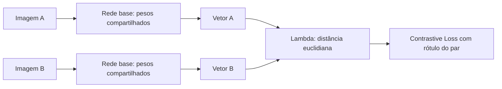
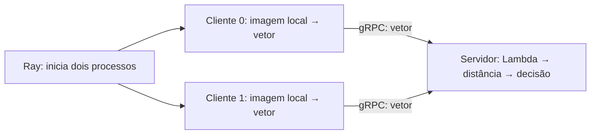

# Laboratório 4 — redes siamesas com TensorFlow, gRPC e Ray

Implementação comentada para estudar o caminho completo: criar pares de imagens,
escolher hiperparâmetros com Keras Tuner, treinar uma rede siamesa e distribuir sua
inferência entre dois clientes e um servidor.

## Comece aqui

No terminal **WSL Ubuntu-20.04**:

```bash
cd "/home/bahia/MO809/lab 4"
source ../venv-gpu/bin/activate
python experimento.py
```

Os modelos já treinados estão em `output/`. Esse comando inicia o servidor e os dois
clientes, executa 10 pares aleatórios e encerra os processos que iniciou.
Os resultados ficam em `output/experimento.md` e `output/experimento.json`.

Para refazer **a busca e o treinamento**, preservando a execução entregue:

```bash
python treinar.py --output output/nova_execucao
python experimento.py --output output/nova_execucao
```

A primeira execução baixa o Fashion MNIST. Para instalar as dependências adicionais
no ambiente TensorFlow já funcional: `python -m pip install -r requirements.txt`.
Não use o `requirements.txt` da raiz do repositório: ele corresponde a outro ambiente.
O Python usado aqui é 3.9.5; TensorFlow 2.20.0, Keras 3.10.0 e Keras Tuner 1.4.8.
O treinamento foi executado na RTX 3050 de 6 GB. Clientes e servidor usam CPU para
não disputar a memória da GPU por uma operação pequena.

## Como pensar nesta solução

Uma rede classificadora comum recebe uma imagem e retorna probabilidades de classes.
Nossa **rede base** retorna um vetor de números, chamado *embedding*. A loss ensina
esse vetor a ficar próximo dos vetores de roupas da mesma classe.

Durante o treinamento, usamos **o mesmo objeto de rede** duas vezes. Cada chamada
recebe uma imagem do par, mas os pesos são compartilhados. O TensorFlow calcula os
gradientes de ambos os caminhos e o Adam atualiza esses mesmos pesos.



Depois de treinar, cada cliente carrega uma cópia dos **mesmos pesos salvos**.
Não há atualização de pesos nessa etapa: isso é **inferência distribuída**.
Diferentemente de um treinamento federado, clientes não treinam nem agregam modelos.



**gRPC** define chamadas entre processos; **Protobuf** define o formato das mensagens;
**Ray** cuida de iniciar e coordenar os processos dos clientes. Chamadas `.remote()`
retornam referências futuras; `ray.get()` aguarda os resultados. É necessário disparar
as duas chamadas antes de aguardar, pois o servidor precisa dos dois vetores.

## Ordem sugerida de leitura do código

| Arquivo | O que estudar |
|---|---|
| `dados.py` | Separação de imagens, pares positivos/negativos e lotes com `tf.data` |
| `modelo.py` | `Input`, `Conv2D`, pooling, `Dense`, pesos compartilhados, `Lambda` e loss |
| `treinar.py` | Busca do Tuner, `compile`, `fit`, validação, teste e salvamento |
| `ml.proto` | Contrato das mensagens e dos métodos remotos |
| `mlcliente.py` | Carregar a rede e calcular um vetor localmente |
| `mlservidor.py` | Receber vetores simultaneamente, esperar o par e responder |
| `experimento.py` | Iniciar servidor e clientes Ray e conferir as respostas |
| `config.py` | Caminhos, configuração de CPU/GPU e identificação do modelo |
| `test_lab4.py` | Testes matemáticos, serialização e chamadas gRPC reais |

`ml_pb2.py` e `ml_pb2_grpc.py` são **gerados automaticamente**, não escritos à mão.
Se modificar `ml.proto`, regenere-os no WSL:

```bash
python -m grpc_tools.protoc -I. --python_out=. --grpc_python_out=. ml.proto
```

## Dados e Contrastive Loss

- Fashion MNIST: imagens 28×28, um canal de cinza. Normalização: pixel / 255.
- Separação estratificada e reproduzível: 48.000 imagens de treino, 12.000 de
  validação e 10.000 do teste oficial. A separação ocorre **antes** dos pares.
- Amostramos 30.000 pares de treino, 6.000 de validação e 10.000 de teste.
  Cada conjunto de pares é balanceado: metade mesma classe, metade classes diferentes.
  Nem toda imagem necessariamente aparece nos pares amostrados. Os pares ficam fixos
  entre épocas/trials; apenas a ordem do treino muda. Um positivo não repete a própria
  imagem; pares repetidos podem ocorrer dentro do mesmo conjunto.
- `y=1`: mesma classe; `y=0`: classes diferentes. Classes visuais próximas, como
  camisa e camiseta, ainda são diferentes segundo esse critério supervisionado.

A fórmula usada pra isso foi:

```text
L = y * D² + (1-y) * max(0, margem-D)²
```

Distância não é probabilidade. O limiar é escolhido **somente na validação** para
maximizar a acurácia, considerando todos os cortes possíveis. Empates de distância
ficam juntos; empates de acurácia favorecem o menor limiar. Depois, o teste é avaliado
com o limiar já fixado. Validação orienta as escolhas; seu desempenho é otimista em
relação à avaliação de teste. Não usamos `accuracy` padrão sobre uma distância.

## Keras Tuner

Usamos `RandomSearch`, objetivo `val_loss`, semente 42, 6 trials de até 4 épocas.
Cada trial começa com pesos próprios. O melhor conjunto de hiperparâmetros é usado
para treinar uma nova rede por até 10 épocas, com `EarlyStopping` e restauração dos
pesos da melhor época de validação.

| Hiperparâmetro | Espaço de busca |
|---|---|
| Filtros da primeira convolução | 16, 32 |
| Filtros da segunda convolução | 32, 64 |
| Unidades da camada densa | 64, 128 |
| Dimensão do embedding | 16, 32, 64 |
| Dropout | 0,0; 0,2 |
| Taxa de aprendizado Adam | 0,001; 0,0003 |

O esqueleto com duas convoluções 3×3, pooling 2×2 e ReLU delimita a família pesquisada.
São 96 combinações possíveis; testar 6 não garante o ótimo global. Batch size 128,
margem 1 e orçamento de épocas são controles do experimento, não parâmetros escolhidos
pelo Tuner. A busca é sequencial na única GPU; Ray é usado na etapa distribuída.
Para ampliar a busca:

```bash
python treinar.py --output output/busca_maior --trials 20 --epocas-busca 8 --epocas 20
```

O programa recusa diretórios que já contenham busca/modelo para não misturar resultados.
Para um teste rápido do pipeline, sem valor de avaliação final:

```bash
python treinar.py --output output/smoke --trials 1 --epocas-busca 1 --epocas 1 \
  --pares-treino 200 --pares-validacao 100 --pares-teste 100
```

## Rodar manualmente em três terminais

Em **cada terminal**, entre nesta pasta e ative `../venv-gpu/bin/activate`.

```bash
# Terminal 1: servidor
python mlservidor.py

# Terminal 2: cliente 0 (aguarda o outro cliente)
python mlcliente.py 0 --rodada par-1

# Terminal 3: cliente 1 (use a mesma rodada)
python mlcliente.py 1 --rodada par-1
```

Inicie os dois clientes dentro do timeout de 30 segundos do servidor. Para cada
novo par, use uma nova rodada (`par-2`, etc.). `--seed` controla a amostragem; executar
novamente o cliente manual com a mesma seed repetirá sua primeira escolha.
O experimento Ray mantém o gerador vivo e sorteia outra imagem a cada rodada.

O endereço padrão é `127.0.0.1:50054`. Pode alterá-lo com `--host`/`--port` no servidor
e `--endereco HOST:PORT` nos clientes. Para máquinas diferentes, copie os mesmos
`rede_base.keras`, `metadata.json` e `dados_clientes.npz` para cada cliente; o servidor
precisa de `rede_base.keras`, `metadata.json` e `comparador.keras`. Esta demonstração
usa gRPC sem TLS, destinado ao laboratório local/rede confiável.

O SHA-256 do arquivo identifica os pesos e impede comparar embeddings de modelos
diferentes. Rodadas impedem misturar pares concorrentes. O primeiro RPC espera com
`Condition.wait()`, liberando o lock para a segunda thread. Resultados ficam em cache
por até cerca de 5 minutos (limpeza em novas requisições), permitindo reenvio idêntico;
reenviar outro vetor para o mesmo cliente/rodada é erro. Não há retry automático.

No JSON do experimento, rótulos e índices aparecem apenas para conferir os resultados
localmente. Eles **não são enviados ao servidor gRPC**. Os embeddings continuam sendo
representações dos dados; enviar vetores não oferece, por si só, garantia de privacidade.

## Testes e resultados

```bash
python -m unittest -v test_lab4.py
python -m pip check
# Testar os artefatos de outra execução:
LAB4_OUTPUT=output/nova_execucao python -m unittest -v test_lab4.py
```

Os testes verificam rótulos e partições, loss e gradientes, limiar com empates,
salvamento/carregamento seguro, equivalência entre inferência conjunta e separada,
respostas gRPC, reenvio, modelo incompatível, NaN/dimensão inválida e cliente ausente.
O experimento também verifica PIDs distintos e igualdade entre a distância recebida
e a calculada diretamente dos vetores enviados.

Resultados medidos, gráficos e limitações estão em [output/README.md](output/README.md).
As sementes, índices dos pares e versões foram salvos. Pequenas diferenças numéricas
podem ocorrer entre GPU/CPU e versões das bibliotecas. Não há garantia bit a bit.
