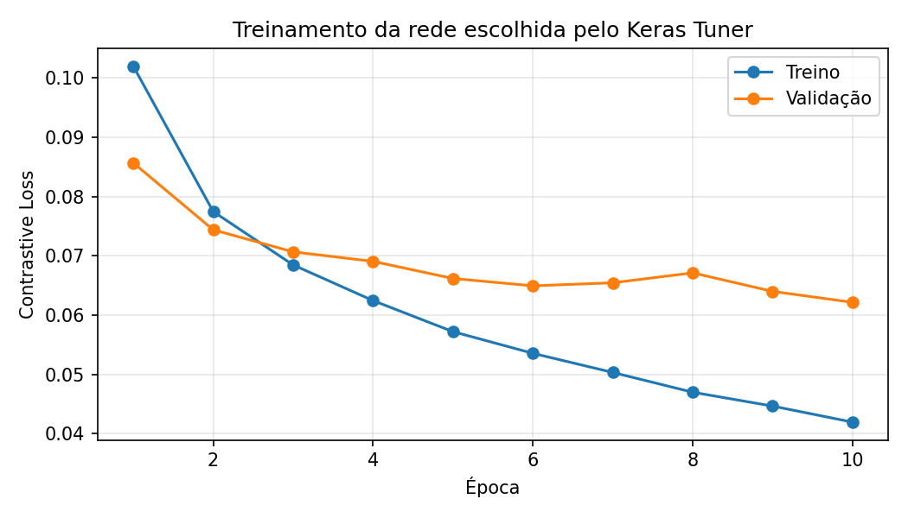
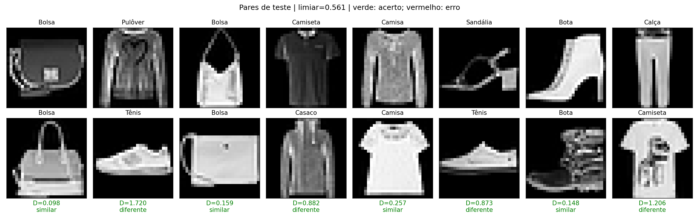

# Resultados do laboratório 4

Execução no WSL com TensorFlow 2.20.0, Keras 3.10.0 e RTX 3050 de 6 GB.
Os comandos e a explicação do código estão no [README principal](../README.md).

## Busca e treinamento

Keras Tuner RandomSearch: 6 configurações, até 4 épocas por configuração, objetivo `val_loss`.
A configuração vencedora foi treinada novamente por 10 épocas. Melhor época: 10.

| Trial | Filtros 1/2 | Densa | Embedding | Dropout | Learning rate | Melhor val_loss |
|---|---|---:|---:|---:|---:|---:|
| 0 | 32/32 | 64 | 16 | 0.2 | 0.001 | 0.070890 |
| 1 | 32/32 | 64 | 16 | 0.2 | 0.0003 | 0.079393 |
| 2 | 32/32 | 128 | 16 | 0.2 | 0.001 | 0.068538 |
| 3 | 16/32 | 128 | 32 | 0.0 | 0.001 | 0.066816 |
| 4 | 16/32 | 128 | 64 | 0.2 | 0.001 | 0.073164 |
| 5 | 16/32 | 128 | 32 | 0.0 | 0.0003 | 0.074111 |

Vencedor: trial 3. A busca cobriu 6 das 96 combinações previstas; não estabelece um ótimo global.
Tempo registrado para dados, busca, treinamento e avaliação: 113.2 segundos (sem Ray).

## Avaliação

| Medida | Valor |
|---|---:|
| Acurácia de validação (6.000 pares) | 93.45% |
| Acurácia de teste (10.000 pares) | 92.64% |
| Contrastive Loss de teste | 0.065107 |
| Limiar calibrado na validação | 0.560570 |

Regra: distância ≤ limiar significa similar. Similaridade real significa mesma classe.
Cada conjunto de pares tem 50% similares e 50% diferentes. Imagens de treino, validação
e teste são distintas. Acurácia aqui é de **pares**, não classificação em dez categorias.

Matriz de confusão no teste:

| Real / Predito | Diferente | Similar |
|---|---:|---:|
| Diferente | 4586 | 414 |
| Similar | 322 | 4678 |

Primeiros oito pares do teste, na ordem fixa de geração (sem seleção por acerto):

## Inferência distribuída

Executada com servidor gRPC e dois clientes Ray em processos distintos, durante 10 rodadas.
Cada cliente carregou os mesmos pesos e escolheu uma imagem aleatória do teste.
A distância recebida foi comparada ao cálculo local dos vetores em todas as rodadas.
Veja [experimento.md](experimento.md) para as decisões e `experimento.json` para vetores e PIDs.

A demonstração apresentou 9 acertos em 10 pares. Todos os pares sorteados eram de classes
diferentes; não use essa pequena amostra como estimativa balanceada de desempenho.
A avaliação de 10.000 pares acima inclui ambas as classes de pares.

## Artefatos

| Arquivo | Conteúdo |
|---|---|
| `rede_base.keras` | Rede que cada cliente carrega para gerar embeddings |
| `comparador.keras` | Modelo com a Lambda usada no servidor |
| `siamesa.keras` | Rede completa, incluindo loss serializada |
| `metadata.json` | Limiar, hash dos pesos, métricas, sementes, versões e configuração |
| `melhores_hiperparametros.json`, `busca.json`, `tuner/` | Resultado e checkpoints da busca |
| `dados_clientes.npz` | Imagens de teste e rótulos usados apenas no diagnóstico local |
| `indices_pares.npz` | Partições e pares para auditoria/reprodução |
| `avaliacao.npz` | Distâncias e rótulos de validação/teste |
| `historico.csv`, `historico.json`, `arquitetura.txt` | Evolução e estrutura da rede |
| `experimento.json`, `experimento.md` | Execução distribuída |
| `treinamento.log`, `testes.log`, `servidor.log`, `execucao_distribuida.log` | Logs de verificação |

Pesos, arrays, checkpoints do Tuner e logs ficam no disco, mas são ignorados pelo Git.
Uma cópia via clone precisa executar o treinamento antes de executar os clientes.

## Verificações e limites

- Sete testes automatizados passaram; `pip check` não apontou dependências incompatíveis.
- Modelos recarregados com o modo seguro padrão; nenhuma desserialização insegura foi habilitada.
- Testes incluem ausência de cliente, reenvio, dimensões inválidas, NaN e pesos incompatíveis.
- A validação é usada na busca, seleção de época e limiar; seus resultados podem ser otimistas.
- Os pares compartilham imagens dentro de cada partição; não são observações independentes.
- Uma única semente/execução e busca pequena: não foi estimada variância entre treinamentos.
- Nos processos CPU, o TensorFlow pode registrar `CUDA_ERROR_NO_DEVICE` ao inicializar:
  a GPU foi desabilitada intencionalmente nesses processos; o treinamento usa a GPU.
