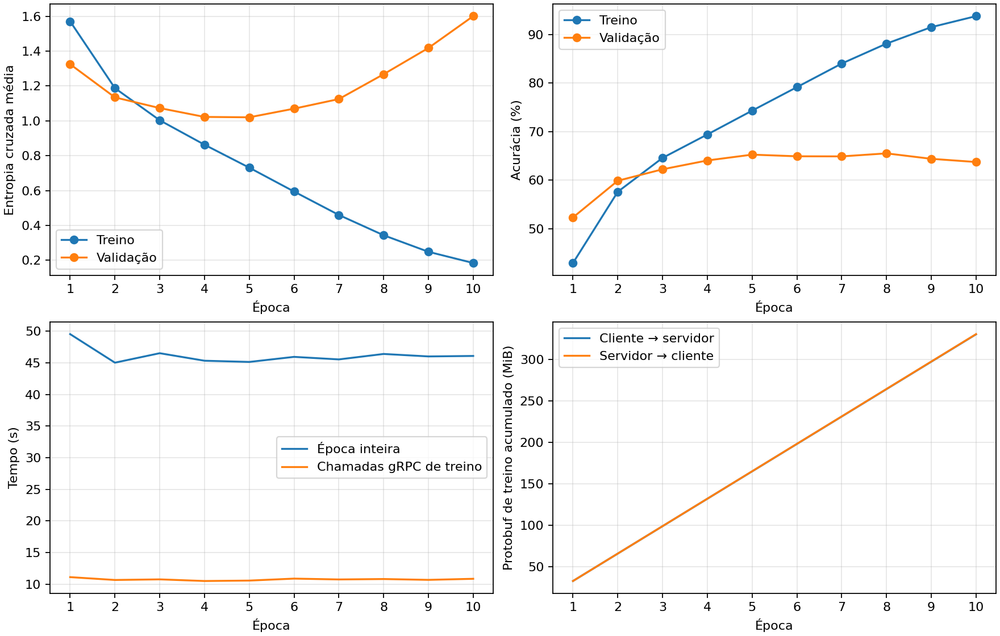

# Resultados — Laboratório 5

Execução com os conjuntos completos de treino, validação e teste do CIFAR-10.

- Clientes: 2; épocas: 10; batch: 64.
- Treino: 45000; validação: 5000; teste: 10000 imagens.
- Melhor época pela loss de validação: **5**.
- Teste: **64.08%** de acurácia; loss **1.0330**.
- Atualizações de M2: 7040; tempo incluindo inicialização dos processos: 7.92 min.

| Cliente | Exemplos de teste | Acurácia | Loss |
|---|---:|---:|---:|
| 0 | 5000 | 63.98% | 1.0417 |
| 1 | 5000 | 64.18% | 1.0243 |

Os três blocos executaram na GPU; PIDs e dispositivos estão em `processos.json`. Cada cliente tem M1/M3 próprios e usa sua partição de teste. A acurácia agregada é ponderada pelo número de exemplos, não é a avaliação de uma única rede global.

A loss de treino reúne lotes durante atualizações; a validação usa os pesos fixos ao final da época. As curvas não medem exatamente o mesmo estado do modelo. O teste foi avaliado após restaurar o checkpoint conjunto da melhor época, sem orientar a seleção. A auditoria dos arquivos salvos pode repetir essa inferência para conferir a reprodução do resultado.

`rpc_seconds` mede o tempo observado das duas chamadas, incluindo serviço e serialização; não isola a latência de rede. Os bytes medem mensagens Protobuf e excluem cabeçalhos de transporte. Execução em loopback não caracteriza uma WAN.

Artefatos: `config.json`, `particoes.json`, `processos.json`, `historico.csv`, `resultados.json`, `M2.keras`, `cliente_N/M1.keras`, `cliente_N/M3.keras` e `cliente_N/results.csv`. Os modelos formam um checkpoint de inferência; o estado completo dos otimizadores para retomada não é salvo.

## Interpretação

Há sinais de sobreajuste após a época selecionada: a loss de treino caiu de 0.7313 para 0.1842, enquanto a de validação passou de 1.0204 para 1.6010. Por isso, a entrega usa o checkpoint escolhido pela validação, preservando a arquitetura didática e o orçamento de 10 épocas desta execução.

Os testes, a auditoria dos checkpoints e os limites de reprodução numérica estão em [VALIDACAO.md](VALIDACAO.md).
